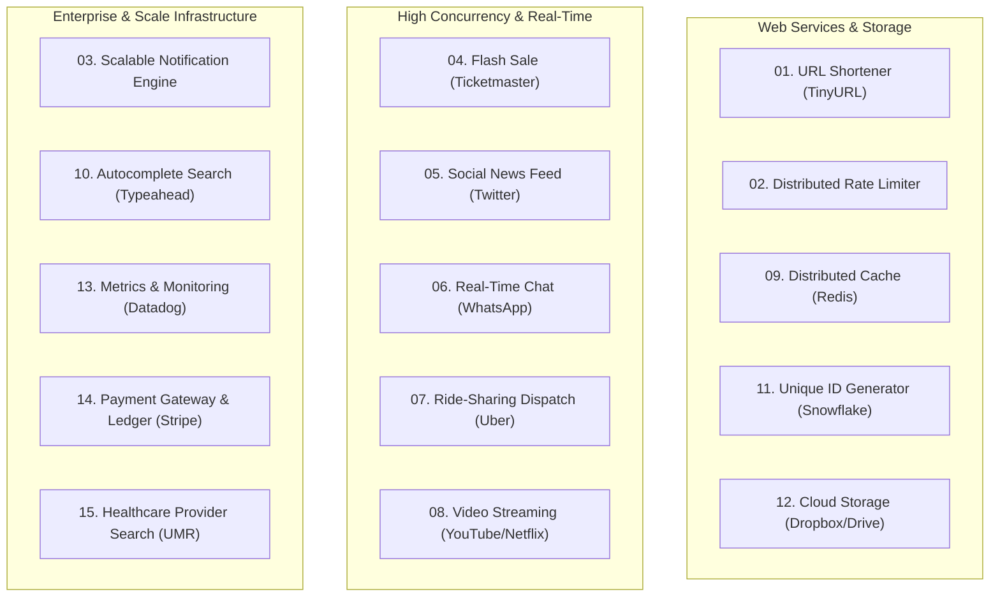

# 🏛️ System Design Master Command Center

A complete preparation system for SDE 2 and Senior Software Engineering system design interviews. Covers core foundational cheatsheets, a battle-tested 45-minute delivery framework, and **15 end-to-end, production-grade solutions** for the most frequently asked design questions in the industry.

---

## ⚡ Quick Navigation

- [📚 Master Solutions Directory (`solutions/`)](./solutions/README.md) — 15 in-depth case studies with architecture diagrams
- [⏱️ 45-Minute Interview Protocol (`cheatsheet/01-framework-and-timing.md`)](./cheatsheet/01-framework-and-timing.md) — Structured time management strategy
- [🔢 Back-of-the-Envelope Math (`cheatsheet/02-back-of-envelope-math.md`)](./cheatsheet/02-back-of-envelope-math.md) — Latency numbers, QPS, and storage formulas
- [🧱 Architectural Building Blocks (`cheatsheet/03-building-blocks.md`)](./cheatsheet/03-building-blocks.md) — Caching, databases, queues, and load balancers
- [📝 Interview Practice Tracker (`design-practice.md`)](./design-practice.md) — Structured self-assessment & rehearsal tracker

---

## 🗺️ The 15 High-Yield System Design Problems

---

## 🏆 The SDE 2 Evaluation Rubric

Interviewers evaluate four dimensions during a 45-minute design interview:

1. **Scope & Requirement Engineering (25%):**
   - Did you ask clarifying questions before jumping into architecture?
   - Did you correctly identify the read-heavy vs write-heavy nature and consistency requirements?
2. **High-Level System Architecture (30%):**
   - Are the components cleanly separated?
   - Are APIs RESTful/gRPC compliant and schemas normalized/denormalized with clear justification?
3. **Deep Technical Nuances & Bottlenecks (35%):**
   - Can you explain how Redis Lua scripts prevent race conditions in rate limiters?
   - Can you explain how Twitter solves the celebrity fan-out problem?
   - Can you explain how consistent hashing prevents cache stampedes during node failover?
4. **Communication & Trade-off Justification (10%):**
   - Did you drive the discussion or wait passively for hints?
   - Can you defend SQL vs NoSQL or Push vs Pull with concrete trade-offs?

---

## 🔗 Related Workspaces

- [🏠 Root Workspace Map](../README.md)
- [📦 DSA Master Command Center & 250 Questions](../DSA/README.md)
- [🎯 First 30 Technical Questions](../06-question-bank/first-30.md)
