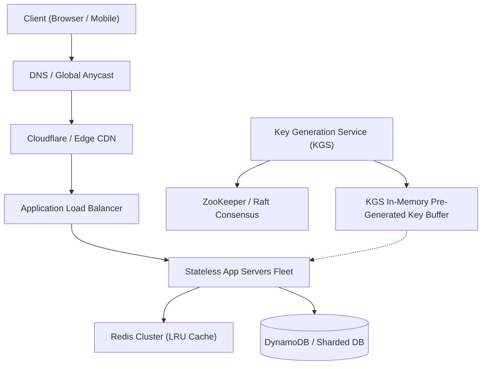

# System Design: Design a URL Shortener (TinyURL / Bitly)

> **Interview Level:** SDE 2 / Senior Backend  
> **Frequency:** ★★★★★ (Universal FAANG & Top Tech prompt)  
> **Core Concepts:** Base62 Encoding, Key Generation Service (KGS), Hash Collisions, Sharding, Redis Caching, Bloom Filters.

---

## 1. Requirements & Scope

### Functional Requirements
1. **URL Shortening:** Given a long URL (e.g. `https://example.com/very/long/path?param=value`), generate a unique, short alias (e.g. `https://tiny.url/aZ7b12`).
2. **URL Redirection:** Accessing the short link must redirect the user to the original long URL with HTTP `301 Moved Permanently` or `302 Found`.
3. **Custom Aliases (Optional):** Allow users to specify a custom short alias (up to 16 characters).
4. **Link Expiration:** Links should expire after a configurable TTL (default 2 years).

### Non-Functional Requirements
1. **High Availability:** Redirection must never fail (99.999% uptime).
2. **Ultra-Low Latency:** Redirection response time P99 < 15ms.
3. **Unpredictability:** Short URLs must not be sequential to prevent scraping.
4. **Durability:** Stored mappings must be durable and never lost during the retention period.

---

## 2. Back-of-the-Envelope Capacity Estimation

- **Traffic Scale:**
  - New short URLs created: **100 Million/month**
  - Read/Write ratio: **100:1** (Read-heavy system)
  - Short URL generations/sec (Write QPS):
    $$\frac{100\text{M}}{30 \times 86400} \approx 38.5 \approx 40\text{ writes/sec}$$
  - Redirections/sec (Read QPS):
    $$40 \times 100 = 4,000\text{ reads/sec}$$
  - Peak Read QPS ($2\times$): **8,000 reads/sec**

- **Storage Estimation (5 Years):**
  - Total records: $100\text{M/month} \times 12 \times 5 = 6\text{ Billion records}$
  - Average URL record size:
    - `short_key`: 7 bytes
    - `original_url`: 500 bytes
    - `created_at` / `expires_at`: 16 bytes
    - Total per record $\approx 550\text{ bytes}$
  - 5-year storage:
    $$6\text{ Billion} \times 550\text{ bytes} \approx 3.3\text{ TB}$$

- **Memory / Cache Estimation (80/20 Rule):**
  - Daily read requests: $4,000 \times 86,400 \approx 345\text{ Million/day}$
  - Cache top 20% active links:
    $$0.20 \times 345\text{M} \times 550\text{ B} \approx 38\text{ GB of RAM (Redis)}$$

---

## 3. Core API Design

```http
POST /api/v1/urls
Content-Type: application/json

Request Body:
{
  "long_url": "https://company.internal/docs/architecture-v2",
  "custom_alias": "arch-v2",       // optional
  "expires_in_days": 730           // optional (default 2 years)
}

Response (201 Created):
{
  "short_url": "https://tiny.url/arch-v2",
  "short_key": "arch-v2",
  "expires_at": "2028-09-26T00:00:00Z"
}
```

```http
GET /{short_key}

Response:
HTTP/1.1 301 Moved Permanently / 302 Found
Location: https://company.internal/docs/architecture-v2
```

> **Interview Follow-Up: 301 vs 302 Redirect?**
> - **301 Moved Permanently:** The browser caches the redirection locally. Subsequent clicks never touch our servers. Good for saving server bandwidth; bad for tracking analytics/click counts.
> - **302 Found (Temporary Redirect):** The browser always sends the request to our server first. Essential if we want to log analytics (geo, referrer, timestamps) on every click.

---

## 4. Data Model & Database Selection

### Schema Design
```sql
CREATE TABLE url_mappings (
    short_key VARCHAR(16) PRIMARY KEY,
    long_url VARCHAR(2048) NOT NULL,
    user_id BIGINT,
    created_at TIMESTAMP WITH TIME ZONE DEFAULT NOW(),
    expires_at TIMESTAMP WITH TIME ZONE NOT NULL
);
CREATE INDEX idx_expires_at ON url_mappings(expires_at);
```

### Database Choice: NoSQL (DynamoDB / Cassandra) vs SQL (PostgreSQL)
- **Choice: NoSQL Key-Value / Wide-Column (DynamoDB or Cassandra)** or **Sharded PostgreSQL**.
- **Rationale:** No complex relational joins needed. Access pattern is pure key-value lookup by `short_key`. DynamoDB or Cassandra offers linear horizontal scaling and single-digit millisecond latency.

---

## 5. High-Level System Architecture



---

## 6. Deep Dive: Short Key Generation Strategy

How do we generate a unique 7-character string?

Characters available: `[a-z, A-Z, 0-9]` $\rightarrow 26 + 26 + 10 = 62\text{ characters (Base62)}$.
- A 7-character Base62 string allows:
  $$62^7 \approx 3.52 \times 10^{14} = 3.52\text{ Trillion unique URLs}$$
  This is more than enough for our 6 Billion 5-year requirement.

### Approaches Compared:

| Approach | How it works | Pros | Cons / Gotchas |
|---|---|---|---|
| **1. Hash of URL + Truncate (MD5/SHA256)** | `MD5(long_url) -> take first 7 chars` | Deterministic | High collision risk; requires DB query + counter retry loop. |
| **2. Auto-Incrementing Counter + Base62** | Increment 64-bit integer, convert to Base62 | Zero collisions | Single DB counter is SPOF; easily guessable / security risk. |
| **3. Key Generation Service (KGS) (Recommended)** | Standalone service pre-generates unique keys offline and stores in memory buffer | Zero collisions, $O(1)$ write, unguessable | Requires managing key storage and worker synchronization. |

### The KGS Architecture in Detail:
1. An offline worker sequentially generates 64-bit numbers, converts them to Base62, randomly shuffles them, and stores them in a `keys_available` table.
2. The KGS service loads batches of 10,000 keys into memory.
3. When an App Server needs a key, KGS hands one over in $< 1\text{ms}$.
4. **Concurrency Safety:** KGS uses ZooKeeper to assign disjoint ranges of keys (e.g. Server 1 gets `1,000,000 - 1,999,999`, Server 2 gets `2,000,000 - 2,999,999`) to prevent any lock contention.
5. If a server crashes, the remaining keys in its memory batch are simply discarded; with 3.52 Trillion keys, wasting a few thousand is negligible.

---

## 7. Scaling, Bottlenecks & Edge Cases

1. **Database Sharding:**
   - Shard by `hash(short_key) % num_shards` to distribute writes and reads uniformly.
2. **Cache Stampede (Thundering Herd):**
   - If a viral link expires from Redis, thousands of requests will hit the DB at once.
   - *Fix:* Use Redis distributed locking or probabilistic early re-fetching (XFetch).
3. **Database Cleanup (Expired Links):**
   - Do **NOT** run active sweep queries (`DELETE FROM url_mappings WHERE expires_at < NOW()`) on the production DB because it causes table locking.
   - *Fix:* Lazy deletion: check `expires_at` on lookup; if expired, delete and return 404. Run a background cron job during off-peak hours scanning small partitions.
