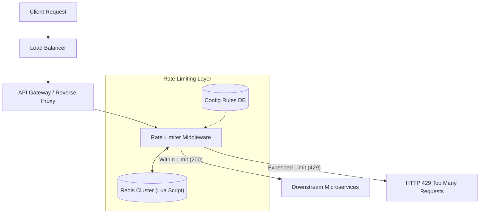

# System Design: Design an API Rate Limiter

> **Interview Level:** SDE 2 / Senior Backend  
> **Frequency:** ★★★★★ (Core system building block asked at Stripe, Google, AWS, Uber)  
> **Core Concepts:** Token Bucket, Leaky Bucket, Sliding Window Counter, Redis Lua Scripts, Race Conditions, Distributed Synchronization.

---

## 1. Requirements & Scope

### Functional Requirements
1. **Limit Requests:** Throttle client requests based on configured rules (e.g. 100 requests per minute per IP or User ID).
2. **Error Feedback:** When throttled, return HTTP `429 Too Many Requests` with `Retry-After` header.
3. **Flexible Rules:** Support rate limiting at multiple levels (per API endpoint, per IP, per authenticated User ID, global).

### Non-Functional Requirements
1. **Ultra-Low Latency:** Must add $< 2-3\text{ms}$ overhead to incoming requests.
2. **High Availability:** If the rate limiter service crashes or Redis fails, fail open (allow requests) to prevent taking down the entire API gateway.
3. **Accuracy & Concurrency:** Prevent race conditions in high-concurrency environments.

---

## 2. Algorithm Comparison

| Algorithm | How it Works | Pros | Cons |
|---|---|---|---|
| **Token Bucket** | Tokens added at constant rate $r$ up to capacity $b$. Request consumes 1 token. | Handles bursts of traffic; memory efficient ($O(1)$ space). | Race condition during read-modify-write without atomicity. |
| **Leaky Bucket** | Requests enter FIFO queue; processed at fixed constant rate. | Smooth, predictable outflow rate. | Bursts of requests fill queue and get dropped immediately. |
| **Fixed Window Counter** | Time divided into fixed windows (e.g. 1 min). Counter resets at boundary. | Very simple to implement. | Traffic spikes at window boundaries can allow $2\times$ the limit. |
| **Sliding Window Log** | Store timestamps of every request in sorted set. Evict timestamps $< (now - window)$. | 100% accurate. | Extreme memory usage ($O(N)$ timestamps per user). |
| **Sliding Window Counter** | Hybrid: $\text{Weight} = \text{prev\_count} \times (1 - \text{elapsed}) + \text{curr\_count}$. | Memory efficient ($O(1)$) and prevents boundary spikes. | Slight approximation ($<0.05\%$ error). |

---

## 3. High-Level Architecture



---

## 4. Deep Dive: Production Implementation with Redis & Lua Script

### The Race Condition Problem
In distributed environments, a naive implementation:
```python
# BROKEN: Race condition between GET and SET
val = redis.get(key)
if val and int(val) > limit:
    return False
redis.incr(key)
return True
```
Under 10,000 concurrent requests, multiple threads read the same counter before `INCR` executes, allowing up to $20\times$ the intended limit!

### The Solution: Atomic Redis Lua Script (Sliding Window Counter)
Redis executes Lua scripts atomically in a single thread, guaranteeing zero race conditions:

```lua
-- KEYS[1]: rate_limit_key (e.g., "ratelimit:user_123:minute")
-- ARGV[1]: window_size in seconds (60)
-- ARGV[2]: max_requests (100)
-- ARGV[3]: current_timestamp (milliseconds)

local key = KEYS[1]
local window = tonumber(ARGV[1])
local limit = tonumber(ARGV[2])
local now = tonumber(ARGV[3])
local clear_before = now - (window * 1000)

-- Remove expired entries
redis.call('ZREMRANGEBYSCORE', key, 0, clear_before)

-- Count current requests in window
local current_requests = redis.call('ZCARD', key)

if current_requests < limit then
    -- Add current request timestamp
    redis.call('ZADD', key, now, now)
    redis.call('EXPIRE', key, window)
    return 1 -- Allowed
else
    return 0 -- Throttled
end
```

---

## 5. Multi-Tier Rate Limiting Headers

When returning responses, always attach standard IETF headers:
```http
HTTP/1.1 429 Too Many Requests
X-RateLimit-Limit: 100
X-RateLimit-Remaining: 0
X-RateLimit-Reset: 1727318460
Retry-After: 35
```

---

## 6. Distributed Scalability & Failure Handling

1. **Multi-Region Synchronization:**
   - Instead of synchronizing Redis across global datacenters (which adds $150\text{ms}$ latency), run **local Redis clusters per region**.
   - Divide global limits by number of regions (e.g., $100\text{ req/min}$ global $\rightarrow 50\text{ req/min}$ in US-East, $50\text{ req/min}$ in EU-West).
2. **Failing Open vs Failing Closed:**
   - If Redis becomes unavailable, the rate limiter middleware catches the timeout and **fails open** (allows traffic through). Logging and alerting are triggered immediately.
