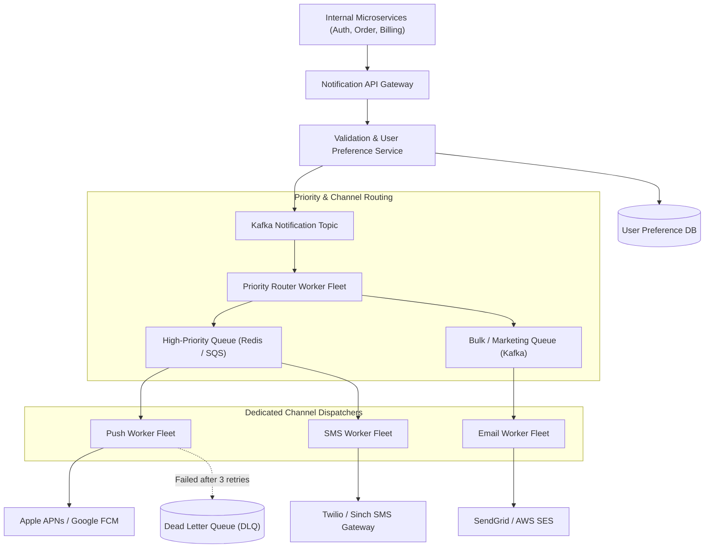

# System Design: Design a Scalable Notification System

> **Interview Level:** SDE 2 / Senior Backend  
> **Frequency:** ★★★★☆ (Amazon, Meta, Uber, Apple)  
> **Core Concepts:** Fan-Out Queues, Priority Queues, Idempotency, Rate Limiting, Dead-Letter Queues (DLQ), Third-Party Integration (APNs, FCM, Twilio, SendGrid).

---

## 1. Requirements & Scope

### Functional Requirements
1. **Multi-Channel Delivery:** Support Mobile Push Notifications (iOS APNs, Android FCM), SMS (Twilio), and Email (SendGrid / AWS SES).
2. **Prioritization:** Urgent notifications (OTP, fraud alert) must be delivered within seconds; promotional notifications can be delayed.
3. **User Preferences & Opt-Outs:** Users can mute specific channels or set quiet hours.
4. **Deduplication / Idempotency:** Users must never receive duplicate notifications (e.g., duplicate OTPs or billing alerts).

### Non-Functional Requirements
1. **High Throughput:** Handle 100 Million notifications per day.
2. **Fault Tolerance:** Retry failed notifications with exponential backoff and send permanently failed messages to Dead-Letter Queues (DLQ).
3. **Low Latency:** High-priority delivery latency $< 5\text{ seconds}$.

---

## 2. High-Level Architecture



---

## 3. Deep Dive: Key Technical Nuances

### 1. Message Deduplication & Idempotency
- When an internal service requests a notification, it must include an `idempotency_key` (e.g. `order_10029_confirmed` or `auth_otp_9281`).
- The Notification Service checks Redis:
  ```sql
  SET notification:idempotency:{key} "PROCESSING" EX 300 NX
  ```
  If `SET NX` returns `nil`, the notification is dropped as a duplicate.

### 2. Handling Third-Party Rate Limits & Failures
- Third-party vendors (Twilio, Apple APNs) impose strict rate limits.
- **Circuit Breaker Pattern:** If Twilio error rate exceeds $10\%$, the circuit breaker opens, routing SMS requests to an alternative secondary provider (e.g. AWS SNS or Sinch).
- **Exponential Backoff with Jitter:**
  $$\text{delay} = \min(300, 2^{\text{attempt}} \times 1000) + \text{rand}(0, 500)\text{ ms}$$

### 3. User Quiet Hours & Scheduling
- If a promotional notification is scheduled during a user's quiet hours (10:00 PM – 8:00 AM local time), the message is pushed to a **Delay Queue** (backed by Redis Sorted Sets or RabbitMQ Delayed Exchange) scheduled to trigger at 8:01 AM in the user's timezone.
