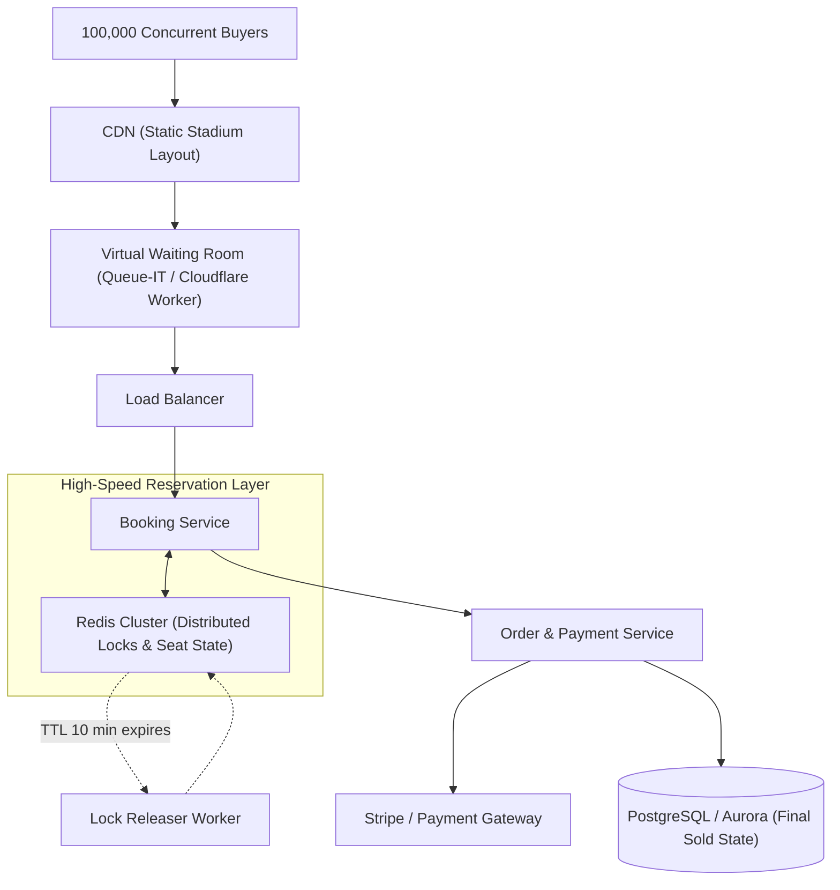

# System Design: Design Ticketmaster / Flash Sale Booking System

> **Interview Level:** SDE 2 / Senior Backend  
> **Frequency:** ★★★★★ (Universal High-Concurrency Question asked at Amazon, Apple, Booking, Uber)  
> **Core Concepts:** High-Concurrency Writes, Distributed Locking (Redlock), Optimistic vs Pessimistic Locking, Inventory Reservation, Idempotency.

---

## 1. Requirements & Scope

### Functional Requirements
1. **View Events & Seats:** Users can browse concerts and view real-time available seats on a stadium map.
2. **Temporary Seat Reservation:** Clicking a seat temporarily locks it for **10 minutes** while the user completes payment.
3. **Checkout & Purchase:** If payment succeeds within 10 minutes, the seat is permanently sold; otherwise, the lock is released.
4. **Prevent Overselling:** Under zero circumstances can a single seat be sold to two different customers.

### Non-Functional Requirements
1. **High Concurrency:** 100,000 users attempting to buy 10,000 seats in the first 60 seconds of a ticket release.
2. **Strong Consistency:** Zero tolerance for double-booking (ACID compliance required).
3. **Fairness:** First-come, first-served queue semantics.

---

## 2. High-Level Architecture



---

## 3. Deep Dive: Concurrency & Lock Management

### Three Concurrency Control Strategies:

| Strategy | How it Works | Pros | Cons / Verdict |
|---|---|---|---|
| **1. Pessimistic DB Locking** | `SELECT * FROM seats WHERE id = 42 FOR UPDATE` | Guaranteed strong consistency. | Deadlocks DB pool; degrades throughput to $<200\text{ QPS}$. **Fails under flash sale.** |
| **2. Optimistic DB Locking** | `UPDATE seats SET status = 'HELD', version = version + 1 WHERE id = 42 AND version = 5` | No long DB locks; fast if low contention. | Catastrophic retry storms when 5,000 users click the same front-row seat. |
| **3. Redis-Based Distributed Hold (Recommended)** | Atomic Lua script in Redis reserves seat + sets 10-minute TTL; DB updated only on confirmation. | Blazing fast ($100,000+\text{ QPS}$ in memory); zero DB pressure during click storm. | Requires careful reconciliation between Redis state and DB state. |

### The Atomic Reservation Lua Script:
```lua
-- KEYS[1]: seat_id (e.g. "event:101:seat:A12")
-- ARGV[1]: user_id
-- ARGV[2]: hold_duration_seconds (600)

local status = redis.call('GET', KEYS[1])
if status == nil or status == "AVAILABLE" then
    redis.call('SET', KEYS[1], "HELD:" .. ARGV[1], 'EX', tonumber(ARGV[2]))
    return 1 -- Successfully Reserved
else
    return 0 -- Seat already held or sold
end
```

---

## 4. Preventing Database Bottlenecks: Virtual Waiting Room
- If 1,000,000 users visit the page at 10:00:00 AM, routing them all to the backend will crash any database.
- **Solution:** A **Virtual Waiting Room** (implemented at Cloudflare / Edge or via Redis FIFO queue).
- Users are assigned a signed token (`ticket_queue_token`) with a position number. The gateway admits only 500 users per second to proceed to the checkout screen.
