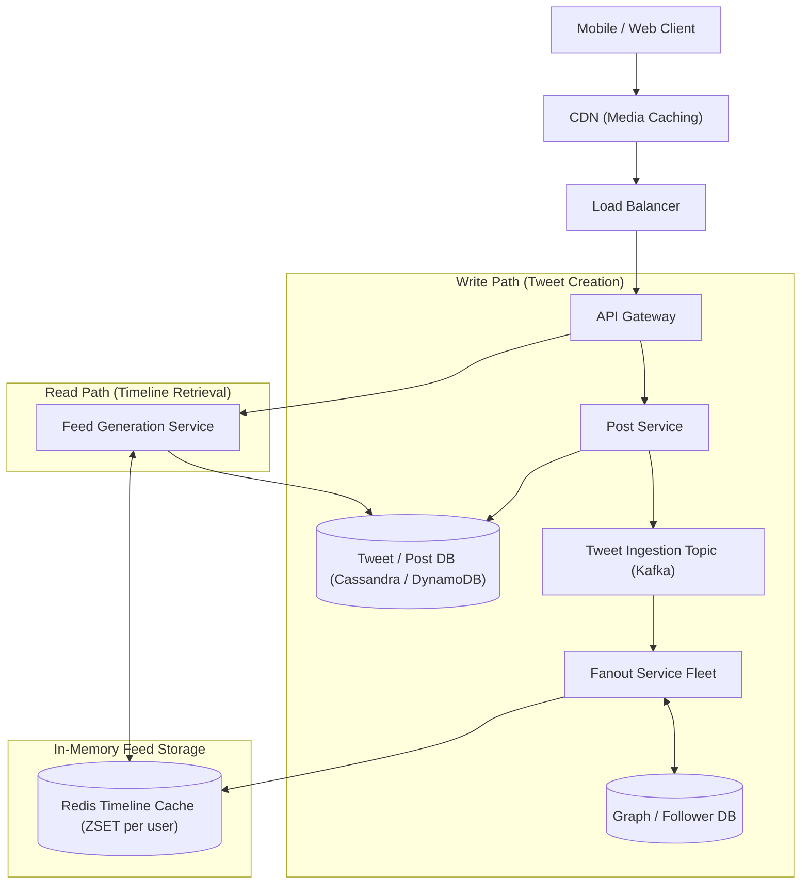

# System Design: Design a Social Media Feed (Twitter / Instagram / Facebook)

> **Interview Level:** SDE 2 / Senior Backend  
> **Frequency:** ★★★★★ (Universal Architecture Benchmark asked at Meta, Twitter, LinkedIn, ByteDance)  
> **Core Concepts:** Fan-Out on Write (Push) vs Fan-Out on Read (Pull), Celebrity / Hot-Key Problem, Cursor Pagination, Redis Timeline Cache.

---

## 1. Requirements & Scope

### Functional Requirements
1. **Post Tweet / Photo:** Users can post content with text and media.
2. **Follow Users:** Users can follow other accounts.
3. **View Home Timeline:** Users view a reverse-chronological or ranked feed of posts from people they follow.
4. **Pagination:** Infinite scrolling through feed items without duplication.

### Non-Functional Requirements
1. **Fast Feed Retrieval:** Home timeline generation P99 $< 200\text{ms}$.
2. **Massive Scale:** 300 Million Daily Active Users (DAU).
3. **Eventual Consistency:** A new tweet appearing in a follower's feed within 2-5 seconds is completely acceptable.

---

## 2. High-Level Architecture



---

## 3. Deep Dive: Push vs Pull vs Hybrid Fan-Out

### The Three Models:

| Model | How it Works | Pros | Cons |
|---|---|---|---|
| **Fan-out on Write (Push)** | When user posts, workers push the tweet ID into **every follower's Redis timeline**. | Read is lightning fast ($O(1)$ read from user's Redis ZSET). | Catastrophic when a user with 80M followers (e.g. celebrity) posts: creates 80M Redis writes! |
| **Fan-out on Read (Pull)** | Feed is compiled dynamically when the user opens the app by querying followees' recent posts. | Zero write amplification. Fast posting. | Reading is slow and expensive: $O(N)$ DB queries and merge-sorting across 1,000 followees. |
| **Hybrid Fan-out (Industry Standard)** | Push for regular users ($< 20,000$ followers); Pull for celebrities / influencers. | Optimal balance between write throughput and instant read retrieval. | Requires user categorization logic and merge step at read time. |

### How the Hybrid Architecture Works in Practice:
1. **Regular User Posts:** The Tweet ID is fanned out to their followers' Redis timelines immediately.
2. **Celebrity User Posts:** The tweet is only written to the celebrity's own post list (no fan-out).
3. **When a User Reads their Feed:**
   - Fetch the user's pre-computed Redis timeline list.
   - Look up any celebrities they follow and pull their latest posts.
   - Merge the two streams in memory (using a k-way heap merge) and return the top 20 items.

---

## 4. Cursor-Based Pagination (Why `OFFSET` Fails)
- **Do NOT use SQL `OFFSET / LIMIT`:**
  ```sql
  -- BROKEN for live feeds:
  SELECT * FROM posts WHERE user_id = 123 ORDER BY created_at DESC LIMIT 20 OFFSET 40;
  ```
  *Flaws:*
  1. $O(N)$ performance: The database scans and discards 40 rows before returning 20.
  2. Duplicate items: If 5 new tweets are posted while the user is reading page 1, clicking page 2 shifts indices, causing the user to see the same tweets again!
- **Use Cursor-Based Pagination:**
  ```sql
  SELECT * FROM posts 
  WHERE user_id = 123 AND created_at < :last_seen_timestamp 
  ORDER BY created_at DESC LIMIT 20;
  ```
