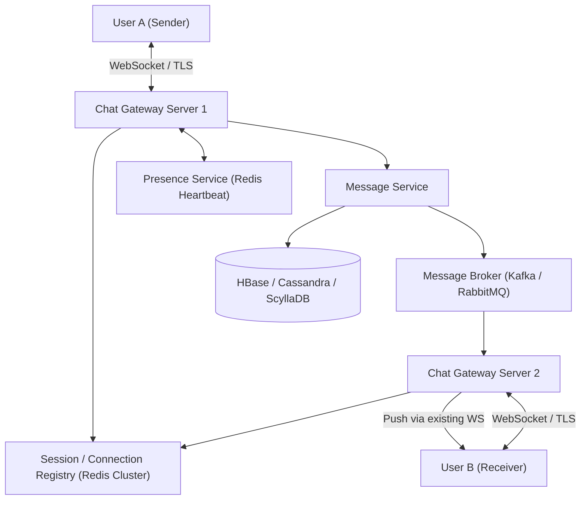

# System Design: Design a Real-Time Chat System (WhatsApp / Slack / Messenger)

> **Interview Level:** SDE 2 / Senior Backend  
> **Frequency:** ★★★★★ (Core real-time architecture asked at Meta, Apple, Discord, Slack)  
> **Core Concepts:** WebSockets, Long Polling, Connection Managers, Presence Service, Message Ordering, Message Sync, Group Chat Fan-Out.

---

## 1. Requirements & Scope

### Functional Requirements
1. **1-on-1 Chat:** Users can send text messages to each other in real-time.
2. **Group Chat:** Support group chats with up to 500 members.
3. **Online Presence:** Show real-time user status (online, offline, last seen).
4. **Message Status:** Sent (1 check), Delivered (2 checks), Read (2 blue checks).
5. **Offline Delivery:** When a user comes back online, deliver pending unread messages in order.

### Non-Functional Requirements
1. **Ultra-Low Latency:** Real-time delivery P99 $< 100\text{ms}$.
2. **Reliability & No Message Loss:** Guaranteed delivery once acknowledged.
3. **End-to-End Encryption (E2EE):** Keys managed on devices (Signal Protocol).

---

## 2. High-Level Architecture



---

## 3. Deep Dive: WebSocket Connection & Session Registry

### 1. Why WebSockets over HTTP Long-Polling?
- HTTP Long-Polling creates a new TCP handshake and header overhead on every timeout, causing high battery drain and server connection churn.
- **WebSockets** provide a persistent, bidirectional, full-duplex TCP connection with only a 2-byte frame overhead per message after the initial HTTP upgrade handshake.

### 2. Session / Connection Registry (Routing Messages)
When User A wants to send a message to User B:
1. User A sends message over their active WebSocket to `Gateway Server 1`.
2. `Gateway Server 1` queries the **Session Registry (Redis Cluster)**:
   ```text
   GET session:user_B -> "gateway_server_2:port_8080"
   ```
3. If User B is connected to `Gateway Server 2`, the message is routed directly across the internal network (via gRPC or Kafka topic assigned to `Gateway Server 2`).
4. `Gateway Server 2` pushes the message down the open WebSocket connection to User B's device.
5. If User B has no active session (offline), the message is persisted to the database and a push notification (APNs/FCM) is triggered.

---

## 4. Message Ordering & Distributed ID Generation
- In a distributed chat system, relying on client timestamps fails because device clocks have skew.
- **Solution:** Use a 64-bit monotonically increasing sequence number per conversation or channel generated via **Twitter Snowflake** or per-chat counter in Cassandra.
- `Message_ID = [Timestamp 41 bits] + [Conversation_ID Hash 10 bits] + [Sequence 13 bits]`.

---

## 5. Group Chat Fan-Out Architecture
- **Small Groups (< 500 members):** Message is published to group topic; the server fans out the message to each member's personal inbox queue.
- **Large Communities (Slack / Discord > 10,000 members):** Fan-out on write causes catastrophic queue multiplication. Instead, use a single shared channel stream in memory; clients subscribe directly to the channel channel buffer.
