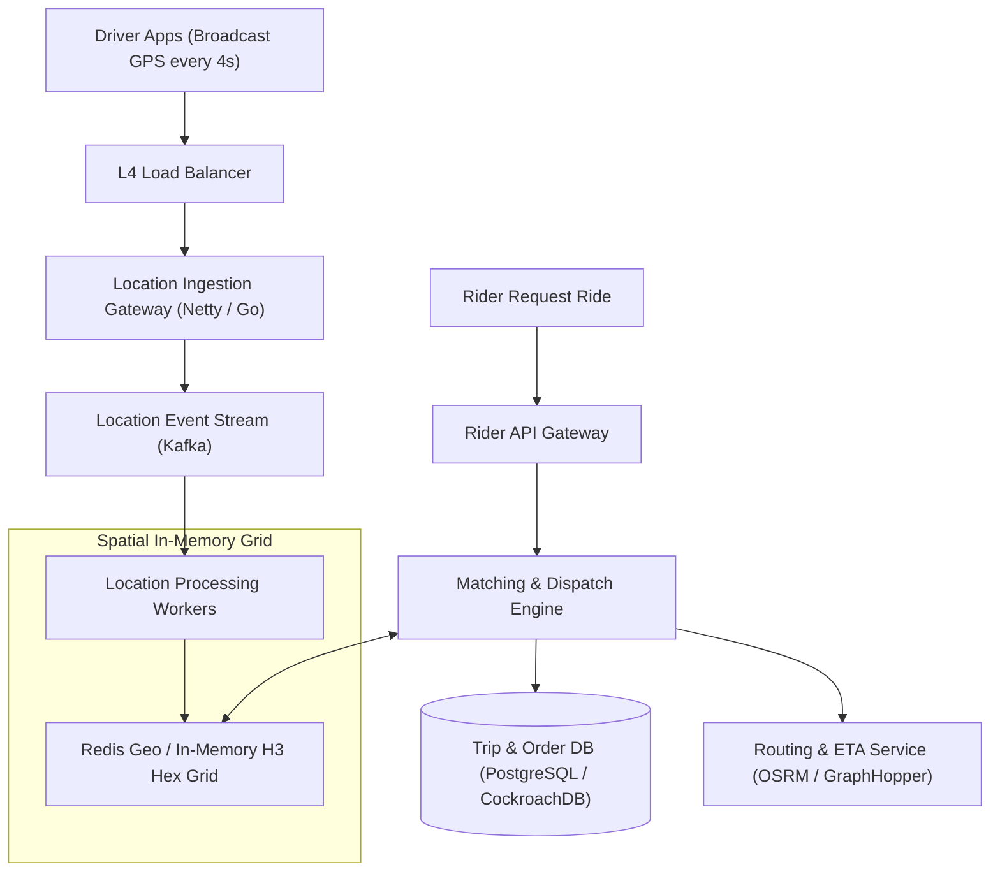

# System Design: Design a Ride-Sharing Service (Uber / Lyft)

> **Interview Level:** SDE 2 / Senior Backend  
> **Frequency:** ★★★★★ (Uber, Lyft, DoorDash, Grab)  
> **Core Concepts:** Geospatial Indexing (Geohash, Google S2, Uber H3), Driver Location Ingestion, Real-Time Dispatch / Matching, Dynamic Surge Pricing.

---

## 1. Requirements & Scope

### Functional Requirements
1. **Driver Location Updates:** Active drivers broadcast their GPS coordinates every **4 seconds**.
2. **Rider Match Request:** A rider requests a ride; system finds and dispatches the nearest available drivers within a radius (e.g. 5 km).
3. **Ride Tracking & ETA:** Calculate route and estimate arrival time in real-time.

### Non-Functional Requirements
1. **High Throughput / Low Latency:** Millions of concurrent GPS pings; matching engine responds in $< 1\text{ second}$.
2. **High Availability:** Location tracking must not crash during peak rush hour.
3. **Consistency:** A driver cannot be matched to two riders at the same time.

---

## 2. High-Level Architecture



---

## 3. Deep Dive: Geospatial Indexing Comparison

Storing GPS latitude and longitude in a standard SQL index requires an expensive 2D bounding box query:
```sql
SELECT * FROM drivers 
WHERE lat BETWEEN 37.70 AND 37.80 AND lon BETWEEN -122.50 AND -122.40;
```
This requires a full index scan and fails to scale at 500,000 updates/second.

### Spatial Indexing Techniques:

| Indexing System | Mechanism | Strengths | Weaknesses |
|---|---|---|---|
| **Geohash** | Hierarchical string encoding interleaving lat/lon bits into a Z-order curve (e.g. `9q8yy`). | Supported natively in Redis (`GEOADD`, `GEORADIUS`), prefix matching finds neighbors. | Edge boundary distortion near poles; rectangular shape causes uneven distances. |
| **Google S2** | Projects Earth onto a cube, subdivided into a Hilbert Curve space-filling curve. | Minimizes boundary distortion, 64-bit integer cell IDs. | Complex mathematical projection. |
| **Uber H3 (Industry Standard)** | Hexagonal hierarchical spatial index. | **Hexagons have uniform neighbor distance:** Every adjacent cell is equidistant from center. | Custom library required. |

---

## 4. Driver Ingestion at Scale: Redis Geo & In-Memory Grids
- With 1 Million active drivers broadcasting every 4 seconds:
  $$\text{Ingestion QPS} = \frac{1,000,000}{4} = 250,000\text{ writes/sec}$$
- Writing to disk is impossible at this volume. All driver locations are stored in an **In-Memory Redis Geo Cluster** partitioned by city/region:
  ```redis
  GEOADD sf_drivers -122.4194 37.7749 driver_101
  GEORADIUS sf_drivers -122.4194 37.7749 5 km WITHDIST COUNT 10 ASC
  ```
- **Driver Locking:** When the dispatch engine offers a ride to a driver, a 15-second distributed lock is acquired in Redis (`SET driver_lock:101 rider_999 EX 15 NX`) to prevent double-booking.
