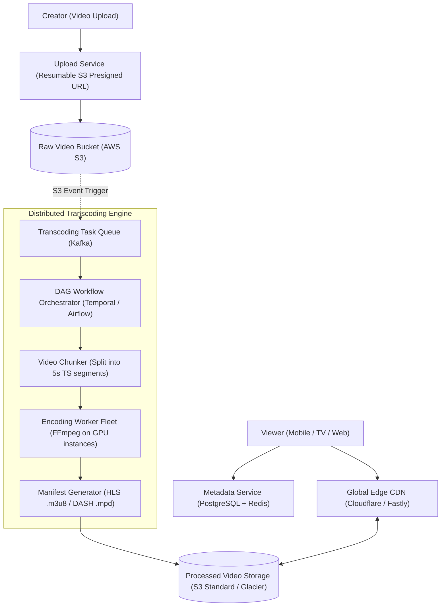

# System Design: Design a Video Streaming Platform (YouTube / Netflix)

> **Interview Level:** SDE 2 / Senior Backend  
> **Frequency:** ★★★★★ (Google, Netflix, Amazon Prime, Hulu)  
> **Core Concepts:** Video Transcoding Pipeline, Chunking & DAG Workflows, Adaptive Bitrate Streaming (HLS/DASH), CDN Edge Caching.

---

## 1. Requirements & Scope

### Functional Requirements
1. **Video Upload:** Creators upload multi-gigabyte video files in any format.
2. **Video Transcoding:** Convert raw video into multiple resolutions (1080p, 720p, 480p, 360p) and bitrates.
3. **Smooth Video Streaming:** Stream video smoothly across variable bandwidth networks (mobile, fiber).
4. **User Actions:** Like, comment, view counts, and search metadata.

### Non-Functional Requirements
1. **High Availability:** 99.99% video playback availability.
2. **Minimal Buffering:** Video starts playing in $< 500\text{ms}$.
3. **Storage Cost Efficiency:** Billions of video files stored economically.

---

## 2. High-Level Architecture



---

## 3. Deep Dive: Adaptive Bitrate Streaming (ABR)
- Raw video uploaded by a creator (e.g. 4K ProRes at 20 GB) cannot be streamed directly to a mobile user on 4G.
- **Adaptive Bitrate Streaming (HLS - HTTP Live Streaming & MPEG-DASH):**
  1. The video is sliced into **5-second chunks** (`segment_001.ts`, `segment_002.ts`, etc.).
  2. Each chunk is encoded into multiple bitrates/resolutions:
     - 1080p (4.5 Mbps)
     - 720p (2.0 Mbps)
     - 480p (800 Kbps)
     - 360p (400 Kbps)
  3. A **Master Playlist (`master.m3u8`)** describes available streams:
     ```m3u8
     #EXTM3U
     #EXT-X-STREAM-INF:BANDWIDTH=4500000,RESOLUTION=1920x1080
     1080p/index.m3u8
     #EXT-X-STREAM-INF:BANDWIDTH=800000,RESOLUTION=854x480
     480p/index.m3u8
     ```
  4. The client video player continuously monitors its current download speed; if WiFi degrades, it dynamically requests the next 5-second chunk at 480p instead of buffering!

---

## 4. Cost Optimization & CDN Tiering
- Videos follow a steep long-tail distribution: **5% of popular videos drive 95% of bandwidth**.
- **Tier 1 (Edge CDN):** The top 5% of trending videos and recently watched chunks are cached globally at edge CDNs close to users.
- **Tier 2 (S3 Standard):** Warm videos accessed occasionally.
- **Tier 3 (S3 Glacier Instant Retrieval / Cold Storage):** Unwatched videos from 5 years ago are archived to save 70% storage costs and hydrated on demand.
