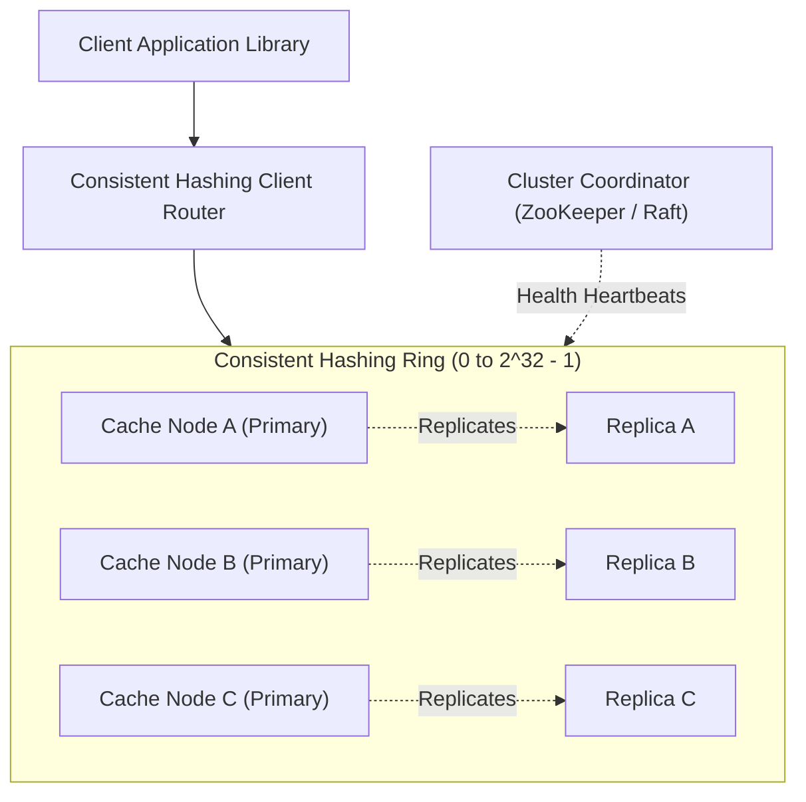

# System Design: Design a Distributed In-Memory Cache (Redis / Memcached)

> **Interview Level:** SDE 2 / Senior Backend  
> **Frequency:** ★★★★★ (Core system infrastructure asked at Meta, Google, Microsoft, Amazon)  
> **Core Concepts:** Consistent Hashing with Virtual Nodes, LRU Eviction, Replication & Failover, Cache Stampede / Avalanche / Penetration.

---

## 1. Requirements & Scope

### Functional Requirements
1. **API:** `get(key)`, `set(key, value, ttl)`, `delete(key)`.
2. **Eviction Policy:** Least Recently Used (LRU) when memory capacity is reached.
3. **Data Expiration:** Support configurable TTL per key.

### Non-Functional Requirements
1. **Sub-Millisecond Latency:** P99 read/write $< 1\text{ms}$.
2. **Horizontal Scalability:** Support adding/removing nodes with minimal re-hashing ($< 1/N$ keys moved).
3. **High Availability:** Auto-failover when a primary cache node crashes.

---

## 2. High-Level Architecture: Consistent Hashing Ring

---

## 3. Deep Dive: Consistent Hashing with Virtual Nodes

### Why Simple Modulo (`hash(key) % N`) Fails:
- If there are $N = 4$ servers and 1 server crashes, the formula becomes `hash(key) % 3`.
- **Result:** Almost 100% of existing keys map to completely different servers. All cached data is missed simultaneously, causing an instantaneous database meltdown.

### The Consistent Hashing Ring:
1. Map the hash space to a circular ring from $0$ to $2^{32} - 1$.
2. Hash server identifiers (IP/hostname) onto positions on the ring.
3. To store a key, compute `hash(key)` and traverse clockwise until the first server node is encountered.
4. **Virtual Nodes (V-Nodes):**
   - *Problem:* A few servers might end up clustered close together, creating "hotspots" (non-uniform distribution).
   - *Solution:* Each physical server is assigned 100–200 virtual positions across the ring (e.g. `ServerA#1`, `ServerA#2`, ..., `ServerA#150`).
   - When a server is added or removed, only $1/N$ of keys are moved, and the load remains evenly distributed.

---

## 4. In-Memory LRU Eviction ($O(1)$ Time)
- Implemented using a **Doubly Linked List + Hash Map**:
  - `Hash Map`: Stores `key -> Node Pointer` for $O(1)$ lookup.
  - `Doubly Linked List`: Tracks access recency. Whenever a key is accessed or updated, move its node to the head.
  - When memory limit is reached, evict the node at the tail in $O(1)$ time.
