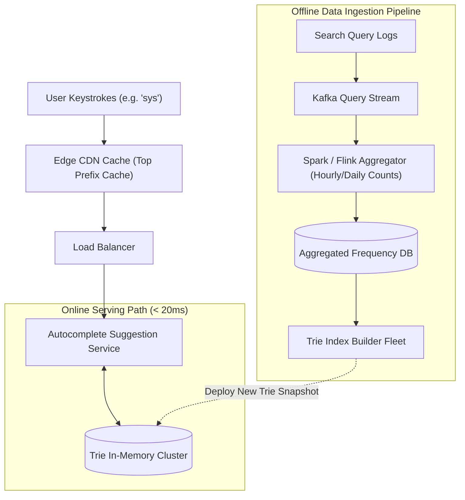

# System Design: Design a Search Autocomplete / Typeahead System

> **Interview Level:** SDE 2 / Senior Backend  
> **Frequency:** ★★★★☆ (Google, Amazon, Meta, Twitter)  
> **Core Concepts:** Trie Data Structure, Precomputed Top-K at Nodes, Offline MapReduce Aggregation, In-Memory Caching, Fuzzy Search.

---

## 1. Requirements & Scope

### Functional Requirements
1. **Real-Time Suggestions:** As a user types in a search box, return the top **5 most frequent search queries** matching the prefix.
2. **Frequency Ranking:** Suggestions ranked by historical query popularity.

### Non-Functional Requirements
1. **Extreme Latency Sensitivity:** Autocomplete suggestions must return in $< 50\text{ms}$ (typing speed is 200–300ms per keystroke).
2. **High Throughput:** 5 billion search queries/day $\rightarrow 25\text{ billion}$ autocomplete keystrokes/day.

---

## 2. High-Level Architecture



---

## 3. Deep Dive: Trie Optimization (Precomputing Top-K)

### The Naive Trie Problem:
A standard Trie node contains children pointers and a word end flag.
To find top 5 suggestions for prefix "sys":
1. Traverse down the Trie to node `'s' -> 'y' -> 's'`.
2. Run a full subtree DFS from `'sys'` to collect all matching words and their frequencies.
3. Sort to find top 5.
- *Problem:* Subtree can contain millions of words. DFS takes $100-300\text{ms}$, violating the $< 50\text{ms}$ SLA!

### The Optimized Trie: Precomputed Top-5 at Every Node
Store the top 5 completed queries and their frequencies **directly inside every TrieNode**:
```python
class TrieNode:
    def __init__(self):
        self.children = {}  # char -> TrieNode
        self.top_k = []     # List of top 5 tuples: [("system design", 95000), ("system32", 12000), ...]
```
- **Lookup Complexity:**
  - Finding the prefix node: $O(L)$ where $L$ is prefix length (e.g. 3 chars $\rightarrow 3$ pointer hops).
  - Retrieving top 5 suggestions: **$O(1)$ instantaneous memory read!**
