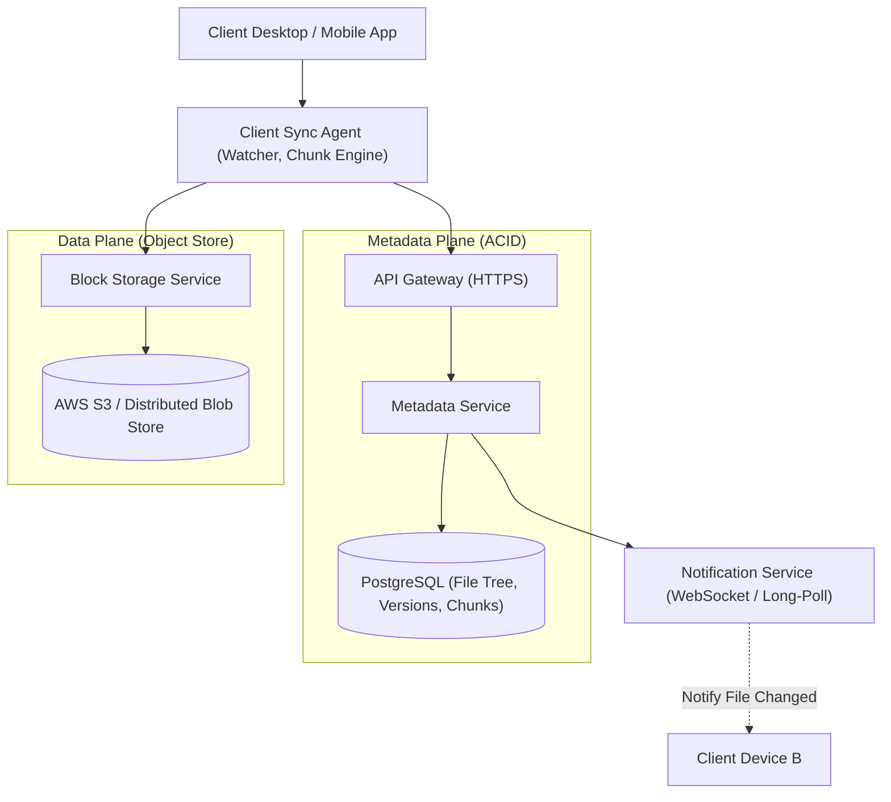

# System Design: Design Cloud Storage & Sync (Dropbox / Google Drive)

> **Interview Level:** SDE 2 / Senior Backend  
> **Frequency:** ★★★★☆ (Dropbox, Google, Microsoft OneDrive, Box)  
> **Core Concepts:** Chunking & Deduplication, Content-Addressable Storage (CAS), Block-Level Delta Sync, Metadata DB vs Object Storage.

---

## 1. Requirements & Scope

### Functional Requirements
1. **File Upload & Download:** Users can upload, download, and update files of any size (up to 10 GB).
2. **Multi-Device File Sync:** Changes made on one device automatically sync across all other devices.
3. **Revision History:** Version history for files (retrieve previous revisions).

### Non-Functional Requirements
1. **Bandwidth Efficiency:** Never re-upload an entire 2 GB file if only 10 KB changed (Delta Sync).
2. **Strong Consistency for Metadata:** Users must never see conflicting file directory states.
3. **Data Durability:** $99.999999999\%$ (11 9's) durability for stored file chunks.

---

## 2. High-Level Architecture

---

## 3. Deep Dive: Chunking, Deduplication & Delta Sync

### 1. File Chunking & Content-Addressable Storage (CAS)
- Files are split into **4 MB chunks**.
- Each chunk is hashed using **SHA-256**:
  $$\text{Chunk Hash} = \text{SHA-256}(\text{chunk\_bytes})$$
- The chunk hash serves as the storage key in AWS S3 (`s3://bucket/chunks/{sha256}`).
- **Global Deduplication:** If 100 users upload the same 50 MB PDF, only one copy of each 4 MB chunk is stored in S3! The metadata DB simply references the same chunk hashes across different user files.

### 2. Delta Sync Algorithm (Rolling Hash / Content-Defined Chunking)
- If a user modifies 1 sentence in the middle of a 1 GB file:
  - Fixed-size chunking would shift all chunk boundaries down, causing every chunk hash to change!
  - **Solution: Content-Defined Chunking (Rabin Fingerprints / FastCDC).**
  - Chunk boundaries are determined by byte content rather than fixed offsets. Only the 1 or 2 chunks containing the edited sentence change their hashes; only those specific 4 MB chunks are uploaded over the network!
