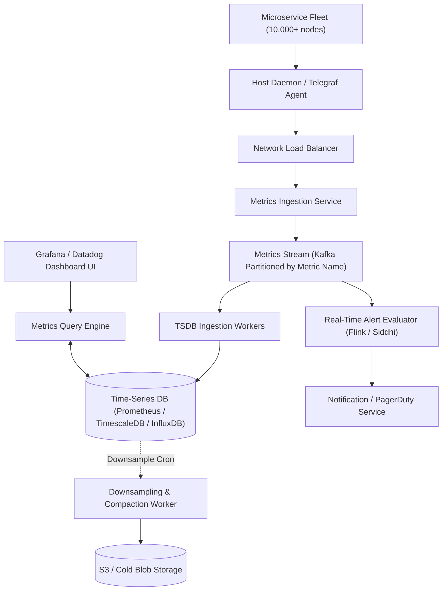

# System Design: Design a Distributed Metrics & Logging System (Datadog / Prometheus)

> **Interview Level:** SDE 2 / Senior Backend  
> **Frequency:** ★★★★☆ (Datadog, AWS CloudWatch, Google, Uber)  
> **Core Concepts:** Time-Series Database (TSDB), Push vs Pull Ingestion, Log Ingestion Pipeline, Downsampling / Rollup, Alerting Engine.

---

## 1. Requirements & Scope

### Functional Requirements
1. **Metrics Ingestion:** Collect system and application metrics (CPU, memory, QPS, latency, error counts) across tens of thousands of microservice instances.
2. **Querying & Dashboards:** Support fast aggregation queries (e.g. `P99(response_time)` grouped by service and region over the last 1 hour).
3. **Alerting:** Trigger alerts (PagerDuty, Slack, Email) when thresholds are violated.

### Non-Functional Requirements
1. **Massive Ingestion Scale:** 10 Million metrics data points per second.
2. **Sub-Second Query Latency:** Dashboard graphs load in $< 500\text{ms}$.
3. **Configurable Retention & Downsampling:** 1-second resolution for 7 days; downsampled to 1-minute resolution for 30 days; 1-hour resolution for 1 year.

---

## 2. High-Level Architecture

---

## 3. Deep Dive: Time-Series Storage & Gorilla Compression
- Metrics data points have the format: `(Metric_Name, Labels/Tags, Timestamp, Value)`.
- Storing uncompressed timestamps and 64-bit floats consumes $\approx 16\text{ bytes}$ per sample. At $10\text{M points/sec}$, that is $160\text{ MB/sec} = 13.8\text{ TB/day}$!
- **Facebook Gorilla Compression Algorithm:**
  - **Timestamp Compression:** Delta-of-delta encoding. Because metrics are reported at steady intervals (e.g. every 10s), the delta-of-delta is almost always `0`, requiring only **1 bit** instead of 64 bits!
  - **Value Compression:** XOR floating-point compression. Consecutive float values are XORed; if values change slightly, leading/trailing zeros are bit-packed, reducing float size from 64 bits to an average of **1.37 bytes** per point ($12\times$ storage reduction).
