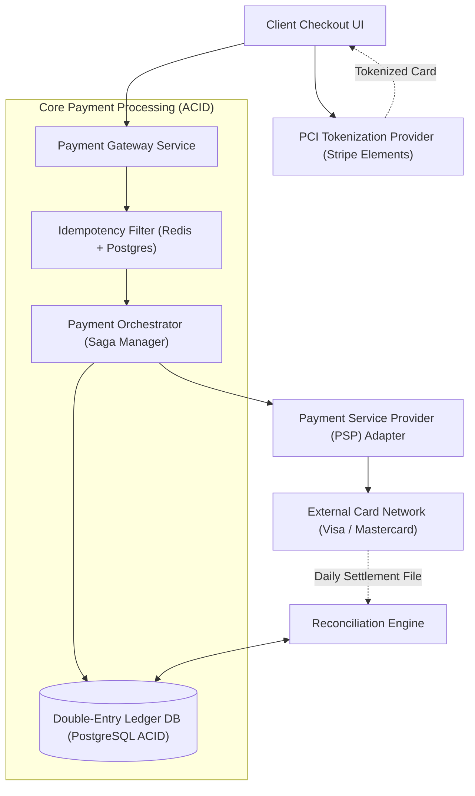

# System Design: Design a Payment Gateway & Financial Ledger (Stripe / PayPal)

> **Interview Level:** SDE 2 / Senior Backend  
> **Frequency:** ★★★★★ (Stripe, PayPal, Square, Uber, Airbnb)  
> **Core Concepts:** Double-Entry Bookkeeping, Idempotency Keys, Distributed Transactions (Saga vs 2PC), Reconciliation Engine, Zero Data Loss.

---

## 1. Requirements & Scope

### Functional Requirements
1. **Process Payments:** Accept customer credit card / bank transactions and charge external processors (Visa/Mastercard).
2. **Double-Entry Ledger:** Record every monetary movement in a debit/credit balanced immutable ledger.
3. **Reconciliation:** Identify and fix discrepancies between internal records and bank settlement files.

### Non-Functional Requirements
1. **Zero Data Loss & Exactly-Once Semantics:** A customer must never be charged twice.
2. **Auditability & Immutability:** Financial ledger entries can never be updated or deleted (`INSERT-only`).
3. **Regulatory Compliance:** PCI-DSS compliant (card details never touch application servers directly).

---

## 2. High-Level Architecture



---

## 3. Deep Dive: Idempotency & Double-Entry Bookkeeping

### 1. Guaranteed Exactly-Once Processing (Idempotency Key)
- Every payment request includes a unique client-generated UUID `Idempotency-Key` header:
  ```http
  POST /api/v1/charges
  Idempotency-Key: c9b2f672-87ad-4b82-93cb-3982e0ad8821
  ```
- **Execution Flow in PostgreSQL:**
  1. `INSERT INTO idempotency_keys (key, status, response) VALUES ('c9b...', 'STARTED', NULL)` with unique constraint.
  2. If a network timeout occurs and client retries, the second `INSERT` fails on unique violation; the service polls the existing transaction status and returns the cached result without charging the card again!

### 2. Double-Entry Bookkeeping Principles
- Money is never "created" or "destroyed"; every financial transaction consists of at least two entries: a **Debit** and a **Credit**.
- **Fundamental Invariant:**
  $$\sum \text{Debits} = \sum \text{Credits}$$
- **Example: Customer buys a $100 product (with $3 Stripe fee and $97 Merchant payout):**

| Account | Debit ($) | Credit ($) |
|---|:---:|:---:|
| Customer Cash / Receivables | 100.00 | |
| Merchant Payable | | 97.00 |
| Stripe Processing Fee Revenue | | 3.00 |
| **Total** | **100.00** | **100.00** |

- Ledger tables are strictly **append-only**. Corrections are handled via refund/reversal entries, never `UPDATE` statements.
