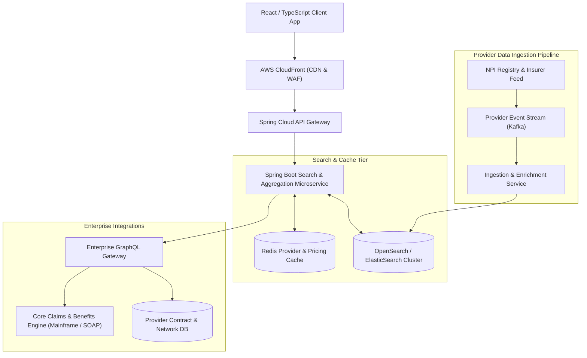

# System Design: Design a Healthcare Provider Search & Price Estimation System

> **Interview Level:** SDE 2 / Senior Backend (Directly tailored to UMR / Healthcare Profile)  
> **Frequency:** ★★★★★ (Targeted domain question for Healthcare, Insurance, and Enterprise Full-Stack roles)  
> **Core Concepts:** ElasticSearch / OpenSearch Inverted Index, GraphQL Federation, Multi-Tier Caching, CMS Compliance / Price Transparency, Downstream Failure Resiliency.

---

## 1. Requirements & Scope

### Functional Requirements
1. **Provider Directory Search:** Search in-network doctors, clinics, and hospitals by specialty, geo-location, accepting new patients, and language.
2. **Out-of-Pocket Price Estimation:** Given a member's insurance plan, deductible status, and medical procedure code (CPT), estimate out-of-pocket costs.
3. **Provider Details & In-Network Verification:** View provider credentials, affiliated hospital networks, and contract statuses.

### Non-Functional Requirements
1. **Low Latency Search:** Search responses returned in $< 150\text{ms}$.
2. **Compliance & Privacy:** Full HIPAA and CMS Price Transparency Rule compliance (data encrypted in transit and at rest).
3. **Resilience to Downstream Outages:** If the downstream legacy claims/core pricing engine is slow or down, return fallback baseline estimates with appropriate disclaimers.

---

## 2. High-Level Architecture



---

## 3. Deep Dive: Search Indexing & Geo-Filtering

### 1. Inverted Index with OpenSearch / ElasticSearch
- Relational databases struggle with multi-facet searching (e.g. *Cardiologists within 15 miles speaking Spanish accepting UnitedHealthcare Choice Plus*).
- **OpenSearch Document Structure:**
  ```json
  {
    "provider_id": "PRV-98214",
    "name": "Dr. Sarah Jenkins, MD",
    "specialties": ["Cardiology", "Internal Medicine"],
    "location": { "lat": 37.7749, "lon": -122.4194 },
    "network_plans": ["UHC_CHOICE_PLUS", "UMR_TIER1", "MEDICARE_ADV"],
    "languages": ["English", "Spanish"],
    "accepting_new_patients": true
  }
  ```
- **Combined Filter Query:** Uses a boolean compound query matching `specialties`, filtering by `geo_distance` (radius circle), and checking `term` membership on `network_plans`.

---

## 4. Price Estimation & Resiliency Patterns

1. **Multi-Tier Deductible Calculation:**
   $$\text{Member Out-of-Pocket} = \min(\text{Remaining Deductible}, \text{Contracted Rate}) + \text{Coinsurance} \times (\text{Remaining Balance})$$
2. **Circuit Breaker & Fallback Strategy:**
   - Real-time claims adjudicators often take $1-3\text{ seconds}$ to calculate exact accumulator balances.
   - **Resilience4j Circuit Breaker:**
     - If the legacy benefits service latency exceeds $800\text{ms}$ or fails, the circuit opens.
     - The Spring Boot backend gracefully degrades by serving **Cached Historical Averages** with an explicit UI badge: *"Estimated price based on plan average; final cost subject to deductible verification."*
