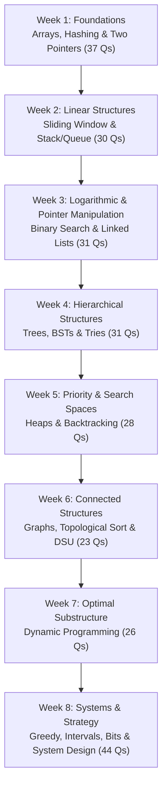

# 📚 Topic-Wise Question Bank: 250 Most Asked Problems

This curriculum organizes the **250 highest-yield, most-frequently-asked LeetCode questions** across top tech companies into **15 structured patterns**. Every question is cross-referenced with real interview frequency data from Google, Amazon, Meta, Microsoft, Apple, Bloomberg, and 200+ companies.

---

## 🗺️ Master Curriculum Breakdown (250 Questions)

| Topic # | Category | Guide Link | Total | 🟢 Easy | 🟡 Medium | 🔴 Hard | Primary Core Patterns |
|:---:|---|---|:---:|:---:|:---:|:---:|---|
| 01 | 📦 Arrays & Hashing | [01-arrays-and-hashing.md](./01-arrays-and-hashing.md) | **23** | 5 | 17 | 1 | The cornerstone of technical interviews |
| 02 | 👉👈 Two Pointers | [02-two-pointers.md](./02-two-pointers.md) | **14** | 7 | 6 | 1 | Techniques for sorted arrays, palindrome verifications, container shrinkage, and collision detection without nested loops |
| 03 | 🪟 Sliding Window | [03-sliding-window.md](./03-sliding-window.md) | **14** | 0 | 10 | 4 | Crucial pattern for continuous subarrays and substring problems |
| 04 | 🥞 Stack & Queue | [04-stack-and-queue.md](./04-stack-and-queue.md) | **16** | 3 | 11 | 2 | LIFO and FIFO structures, parsing expressions, matching parentheses, and Monotonic Stacks for next-greater/smaller element problems |
| 05 | 🔍 Binary Search | [05-binary-search.md](./05-binary-search.md) | **15** | 3 | 9 | 3 | Logarithmic time search algorithms, rotated sorted arrays, matrix searches, and binary search on monotonic answer spaces |
| 06 | 🔗 Linked List | [06-linked-list.md](./06-linked-list.md) | **16** | 5 | 9 | 2 | Pointer manipulation, fast & slow pointer cycle detection, in-place list reversal, k-group operations, and deep copying with random pointers |
| 07 | 🌲 Trees & Binary Search Trees | [07-trees-and-bst.md](./07-trees-and-bst.md) | **24** | 7 | 14 | 3 | DFS/BFS traversals, lowest common ancestor, diameter, path sums, tree reconstruction, BST invariants, and tree serialization |
| 08 | 🌿 Tries (Prefix Trees) | [08-tries.md](./08-tries.md) | **7** | 0 | 5 | 2 | Prefix-based tree retrieval, auto-complete dictionaries, wildcard pattern lookups, and Bitwise Tries for maximum XOR calculations |
| 09 | ⛰️ Heaps & Priority Queues | [09-heaps-and-priority-queues.md](./09-heaps-and-priority-queues.md) | **13** | 2 | 8 | 3 | Dynamic min/max tracking, k-way merges, top-k frequent elements, median stream management, and task scheduling |
| 10 | 🔄 Backtracking | [10-backtracking.md](./10-backtracking.md) | **15** | 0 | 13 | 2 | Exhaustive combinatorial state-space searches, subsets, permutations, combination sums, constraint satisfaction, and pruning |
| 11 | 🕸️ Graphs | [11-graphs.md](./11-graphs.md) | **23** | 0 | 19 | 4 | Grid traversals (BFS/DFS), Topological Sort (Kahn's), Disjoint Set Union (Union-Find), Dijkstra's shortest paths, and Tarjan's bridges |
| 12 | 📊 Dynamic Programming | [12-dynamic-programming.md](./12-dynamic-programming.md) | **26** | 2 | 19 | 5 | Optimal substructure and overlapping subproblems: 1D DP, 2D Grid DP, 0/1 & Unbounded Knapsack, Longest Common Subsequences, and Interval DP |
| 13 | ⏱️ Greedy & Intervals | [13-greedy-and-intervals.md](./13-greedy-and-intervals.md) | **17** | 2 | 14 | 1 | Locally optimal decision making, interval mergers, meeting room schedules, jump game reachability, and gas station circuits |
| 14 | ⚡ Bit Manipulation & Math | [14-bit-manipulation-and-math.md](./14-bit-manipulation-and-math.md) | **12** | 7 | 5 | 0 | Bitwise XOR tricks, Brian Kernighan bit counting, fast power squaring, integer overflow management, and prime sieves |
| 15 | 🏗️ Advanced & System / Class Design | [15-advanced-and-design.md](./15-advanced-and-design.md) | **15** | 3 | 9 | 3 | Object-oriented data structure design: LRU/LFU Caches, O(1) Randomized collections, Time-based key-value stores, and Circular buffers |
| | **TOTALS** | | **250** | **46** | **168** | **36** | **100% Industry High-Yield Coverage** |

---

## 🎯 Recommended 8-Week Study Sequence

---

## 📈 Tracking Progress

Use the pre-formatted master CSV tracker to record your attempts:
- [📄 DSA Master Tracker CSV (`250-master-tracker.csv`)](../250-master-tracker.csv)
- Track date, difficulty, self-rating (1–5), redo status, and key learning notes.

---

## 🔗 Related Resources
- [🏢 Company-Wise Question Directory](../company-wise/README.md)
- [🏠 Master DSA Overview](../README.md)
